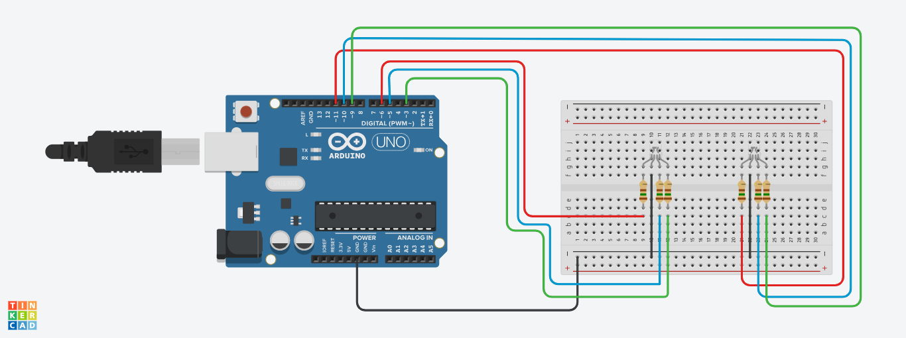

# Projeto Leds RGB

Este projeto foi desenvolvido dentro do Tinkercad, na disciplina de Internet das Coisas (IOT), para criação de um
protótipo com arduíno que simula dois leds rgb que piscam de forma intermitente com várias cores diferentes

## Componentes Usados

- 1 Arduíno Uno
- 1 Protoboard
- 9 Jumpers m/m
- 6 Resistores 150 hms
- 2 leds RGB

## Montando o Circúito

## Explicação do Código

As variáveis R, G e B representam os pinos do Arduino conectados aos componentes vermelho, verde e azul do
primeiro LED RGB. Da mesma forma, as variáveis R2, G2 e B2 representam os pinos conectados ao segundo LED RGB.
 
 int R  = 6;
 int G = 3;
 int B = 5;
 int R2 = 11;
 int G2 = 9;
 int B2 = 10;

Essa função é executada uma vez, no início do programa. Ela configura todos os pinos conectados aos LEDs RGB como
saídas, o que permite ao Arduino controlar as cores dos LEDs.

void setup()
{
  pinMode(R,OUTPUT);
  pinMode(G,OUTPUT);
  pinMode(B,OUTPUT);
  
  pinMode(R2,OUTPUT);
  pinMode(G2,OUTPUT);
  pinMode(B2,OUTPUT);
}

Essa função é repetida continuamente e é onde o controle dinâmico dos LEDs acontece, Após cada atualização dos LEDs,
o código faz uma pausa de 50 milissegundos, o que faz o efeito de transição de cores parecer suave.

void loop()
{
  int v1= random(0,255);
  int v2= random(0,255);
  int v3= random(0,255);
  int v4= random(0,255);
  int v5= random(0,255);
  int v6= random(0,255);
  
  analogWrite(R,v1);
  analogWrite(G,v2);
  analogWrite(B,v3);
  delay(50);
  
  analogWrite(R2,v4);
  analogWrite(G2,v5);
  analogWrite(B2,v6);
  delay(50);
  }
