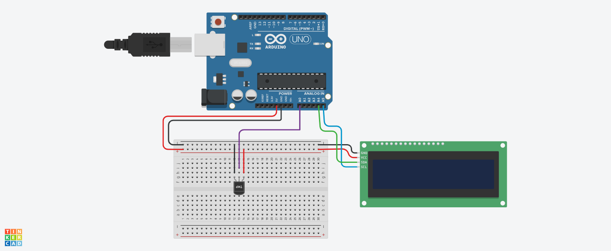

# Projeto Medidor de Temperatura Ambiente

Este projeto foi desenvolvido dentro do Tinkercad, na disciplina de Internet das Coisas (IOT), para criação de um protótipo com arduíno que
simula um sensor que mede em graus celsius a temperatura do ambiente.

## Componentes Usados

- 1 Arduíno Uno
- 1 protoboard
- 1 Tela LCD 16x2
- 5 Jumpers m/m
- 4 Jumpers m/f
- 1 Sensor de temperatura

## Momento do circuito

## Explicação do Código
Inclusão da biblioteca que permite utilizar a tela lcd
#include <LiquidCrystal_I2C.h>
Criação da variável para tela lcd
LiquidCrystal_I2C telalcd (0x20,16,2);

Variável para o sensor de temperatura
int sensor_tmp = A0;
variável para capturar temperatura
int valorlido =0;
Método que define o sensor de temperatura como entrada de dados, liga atela lcd e controla a a intensidade da luminosidade
e limpa os dados que aparecem an tela após a execução
void setup()
{
  pinMode(sensor_tmp,INPUT);
  telalcd.init();
  telalcd.clear();
  telalcd.backlight();
}

Método para capturar a temperatura do ambiente e converter em tensão elétrica e logo mem seguida converter em graus celsius e 
imprime o valor na tela lcd.
void loop()
{
  // capturar o valor da temperatura
  valorlido = analogRead(sensor_tmp);
  // converter o valor da tensão 
  float tensao = (valorlido*5.0)/1023;
  // converter a tensão em graus celsius
  float temperatura = (tensao-0.5)*100;
  
  //imprimir valor da temperatura no LCD
  telalcd.setCursor(0,0);
  telalcd.print("Temperatura:");
  telalcd.setCursor(0,1);
  telalcd.print(temperatura);
  telalcd.print(" C");
  
}
