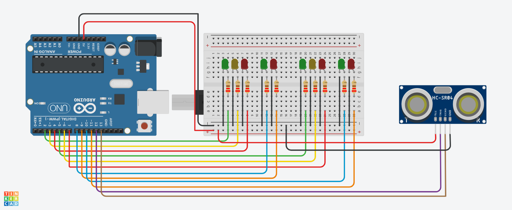

# Projeto Semáforo inteligente

Este projeto foi desenvolvido dentro do Tinkercad, na disciplina de Internet das Coisas (IOT), para criação de um prototipo 
com arduíno que simule quatro semáforos para parta duas vias diferentes, sendo dois semáforos para carros contendo os leds verde,
amarelo e vermelho cada e dois semáforos para pedestres contendo as cores vermelho e verde. Eles serão acionados por um sensor de
distância que será acionado quando o pedestre chegar a 50 cm do sensor de distância, o semáforo dos carros irá fechar e o dos pedestres
irá abrir durante 15 segundos, após esse tempo ele irá fechar e o semáforo de carros abrir até que algum pedestre chegue próximo
do sensor novamente.

## Componentes Usados

- 1 Arduíno Uno
- 1 Protoboard
- 4 leds vermelhos 3.3 v
- 4 leds verdes 3.3 v
- 2 leds amarelos 3.3 v
- 10 Resistores 220 hms
- 22 Jumpers m/m
- 4 Jumpers m/f
- Sensor de distância Ultra-sónico
  
## Montagem do Circuíto

## Explicação do Código

Criação de variáveis dos LEDs para carros informando em qual porta eles estão conectados
int ledVerdeA = 2;
int ledAmareloA = 3;
int ledVermelhoA = 4;
int ledVerdeB = 5;
int ledAmareloB = 6;
int ledVermelhoB = 7;

Criação de variáveis dos LEDs para pedestres informando em qual porta eles estão conectados

int ledVerdePedA = 8;
int ledVermelhoPedA = 9;
int ledVerdePedB = 10;
int ledVermelhoPedB = 11;

Criação de variáveis para os pinos do sensor de distância
int trigPin = 12;
int echoPin = 13;

Criação de variável que recebe o tempo em que os semáforos do pedestre ficará aceso

int tempoPedestres = 15000;

Método que define os leds como dispositivo de saída e  o sensor de distância como um dispositivo de entrada e saída
de dados, e definir a sequência de acionamento dos ledes atravès dos comandos HIGH(acender) e LOW (apagar).

void setup() {
    pinMode(ledVerdeA, OUTPUT);
    pinMode(ledAmareloA, OUTPUT);
    pinMode(ledVermelhoA, OUTPUT);
    pinMode(ledVerdeB, OUTPUT);
    pinMode(ledAmareloB, OUTPUT);
    pinMode(ledVermelhoB, OUTPUT);
    pinMode(ledVerdePedA, OUTPUT);
    pinMode(ledVermelhoPedA, OUTPUT);
    pinMode(ledVerdePedB, OUTPUT);
    pinMode(ledVermelhoPedB, OUTPUT);
    pinMode(trigPin, OUTPUT);
    pinMode(echoPin, INPUT); 
    digitalWrite(ledVerdeA, HIGH);
    digitalWrite(ledVerdeB, HIGH);
    digitalWrite(ledVermelhoA, LOW);
    digitalWrite(ledVermelhoB, LOW);
    digitalWrite(ledAmareloA, LOW);
    digitalWrite(ledAmareloB, LOW);
    digitalWrite(ledVermelhoPedA, HIGH);
    digitalWrite(ledVermelhoPedB, HIGH);
    digitalWrite(ledVerdePedA, LOW);
    digitalWrite(ledVerdePedB, LOW);
}
Métod define a lógica de ativação dos leds através dos comandos de condição if/else convertendo a distância de metros para
cientímetros, sendo que o sensor será acionado quando o pedestre chega a 50 com dele, acionando o semáforo dos carros irá 
apagar o led verde, acionar o amarelo duarante 3 segundos e logo em seguida o vermelho, enquanto o led verde do semáforo de
pedestres irá acender.
void loop() {
    long duracao, distancia;
    digitalWrite(trigPin, LOW);
    delay(2);
    digitalWrite(trigPin, HIGH);
    delay(10);
    digitalWrite(trigPin, LOW);
    duracao = pulseIn(echoPin, HIGH);
    distancia = (duracao * 0.034) / 2;
    if (distancia < 50) {
        digitalWrite(ledVerdeA, LOW);
        digitalWrite(ledVerdeB, LOW);
        digitalWrite(ledAmareloA, HIGH);
        digitalWrite(ledAmareloB, HIGH);
        delay(3000); 
        digitalWrite(ledAmareloA, LOW);
        digitalWrite(ledAmareloB, LOW);
        digitalWrite(ledVermelhoA, HIGH);
        digitalWrite(ledVermelhoB, HIGH);
        digitalWrite(ledVerdePedA, HIGH);
        digitalWrite(ledVerdePedB, HIGH);
        digitalWrite(ledVermelhoPedA, LOW);
        digitalWrite(ledVermelhoPedB, LOW);
        delay(tempoPedestres);
        digitalWrite(ledVerdePedA, LOW);
        digitalWrite(ledVerdePedB, LOW);
        digitalWrite(ledVermelhoPedA, HIGH);
        digitalWrite(ledVermelhoPedB, HIGH);
        digitalWrite(ledVerdeA, HIGH);
        digitalWrite(ledVerdeB, HIGH);
        digitalWrite(ledVermelhoA, LOW);
        digitalWrite(ledVermelhoB, LOW);
    } else {
        digitalWrite(ledVermelhoA, LOW);
        digitalWrite(ledVermelhoB, LOW);
        digitalWrite(ledVerdeA, HIGH);
        digitalWrite(ledVerdeB, HIGH);
    }
    delay(100);

