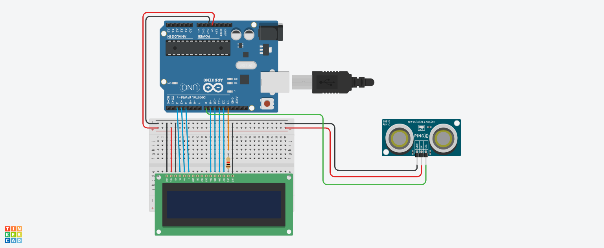

# Prjeto de Tela LCD com sensor de Distância

Este projeto foi desenvolvido dentro do Tinkercad, na disciplina de Internet das Coisas (IOT),
para criação de um prototipo com arduíno que simule uma mensagem de Mantenha distância toda vez 
que alguém se aproximar a menos de 1 metro do sensor.

## Componentes Usados

- 1 Arduíno Uno
- 1 Protoboard
- 1 Resistor de 1 KOhms
- 14 jumpers m/m
- 3 jumpers m/f
- 1 sensor de Distância
- 1 Tela LCD 16x2

## Montagem do Circuito

## Explicação do Código

inclusão da biblioteca do lcd
#include <LiquidCrystal.h>

Criação da variável do lcd
LiquidCrystal lcd (2,3,4,9,10,11,12);

int ledLcd =13;

Método para capturar a distância e retorna o valor para o arduíno.

long distancia(int trigger, int echo){
  pinMode(trigger,OUTPUT);
  digitalWrite(trigger,LOW);
  delay(5);
  digitalWrite(trigger,HIGH);
  delay(10);
  digitalWrite(trigger,LOW);
  pinMode(echo,INPUT);
  return pulseIn(echo,HIGH);
}

Metodo para inicializar as portas de conexão do lcd, e as configurações iniciais.

void setup()
{
  pinMode(ledLcd,OUTPUT);
  digitalWrite(ledLcd, HIGH);
  lcd.begin(16,2);
  lcd.clear(); 
}

Metodo para executar infinitamente o código de conversão da distãncia para cm, e
impressão das mensagens de "Mantenha distância".

void loop()
{
 int cm = 0.01723 * distancia(8, 8); 
  
  if(cm<100){
    lcd.setCursor(0,0);
 	lcd.print("MANTENHA");
 	lcd.setCursor(0,1);
 	lcd.print("DISTANCIA!");
  }
  else{
    lcd.clear();
  }
 
}
